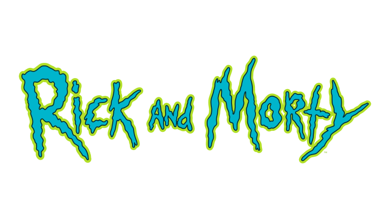

# Rick and Morty Website

## Introduction

This project revolves around the creation of a website that leverages the capabilities of the Rick and Morty API. The API facilitates the extraction of data concerning episodes, characters, and locations from the animated series. The website is constructed using HTML, CSS, TypeScript, and Bootstrap.

## Table of Contents

- [Issues Encountered and Resolved](#issues-encountered-and-resolved)
- [Documentation on Using the Rick and Morty API](#documentation-on-using-the-rick-and-morty-api)
- [Lessons Learned](#lessons-learned)
- [Getting Started](#getting-started)
- [Preview](#preview)

## Issues Encountered and Resolved

### Day 1:
- **Issue 1:** Inaccurate Typing in TypeScript Interfaces
  - Description: During the initial stage of implementing data interfaces, inconsistencies in the data types led to typing errors.
  - Solution: We meticulously reviewed the API documentation and made necessary adjustments to our interfaces to ensure accurate typing.

### Day 2:
- **Issue 2:** Bootstrap Grid System Challenges
  - Description: Difficulties arose while attempting to arrange data using the Bootstrap grid system, yielding unexpected outcomes.
  - Solution: Thoroughly exploring the Bootstrap documentation, we restructured the design to effectively harness the grid system.

### Day 3:
- **Issue 3:** Bootstrap Modal Utilization in TypeScript
  - Description: Trouble emerged when incorporating Bootstrap modals within TypeScript. Node module downloads resulted in index.js errors, impeding modal usage.
  - Solution: We opted for an alternative approach to using Bootstrap, avoiding node module-related issues.

### Day 4:
- **Issue 4:** TypeScript "Cannot find name 'bootstrap'.ts(2304)" Error
  - Description: TypeScript failed to recognize the Bootstrap variable, generating an error.
  - Solution: We addressed this by declaring the Bootstrap variable with the 'any' type in TypeScript, ensuring continued development.

### Day 5:
- **Issue 5:** Incorrect "episode" Attribute Usage in Character Interface
  - Description: Episodes failed to load due to a misspelled "episode" attribute within the "character" interface.
  - Solution: We identified and corrected the error by meticulously reviewing the issue and API documentation.

### Day 6:
- **Issue 6:** DOM Manipulation and TypeScript Type Safety
  - Description: Attempting to inject API data into the DOM triggered TypeScript type safety errors.
  - Solution: We grasped the importance of explicitly defining type definitions for API responses and validating data before performing DOM manipulation. This resolved type mismatch issues.
- **Issue 7:** Challenges with Code Organization and Import/Export of Functions
  - Description: Difficulties arose in maintaining clear code organization and proper import/export of functions across different files. This challenge emerged as I attempted to organize the code structure towards the end of the project, leading to issues with function imports and exports. I realized the significance of having a well-organized system in place from the beginning.

## Documentation on Using the Rick and Morty API

The Rick and Morty API enables data extraction related to characters, episodes, and locations. Key endpoints include:
- Episodes: [https://rickandmortyapi.com/api/episode](https://rickandmortyapi.com/api/episode)
- Characters: [https://rickandmortyapi.com/api/character](https://rickandmortyapi.com/api/character)
- Locations: [https://rickandmortyapi.com/api/location](https://rickandmortyapi.com/api/location)

We've implemented pagination using API-provided pagination information to navigate multiple result pages.

## Lessons Learned

### Day 1:
- **Lesson 1:** Thoroughly review API documentation for correct data understanding and TypeScript typing alignment.

### Day 2:
- **Lesson 2:** Gain proficiency in utilizing the Bootstrap grid system for efficient data presentation.

### Day 3:
- **Lesson 3:** Adapt approach to Bootstrap usage to circumvent node module conflicts, fostering seamless development.

### Day 4:
- **Lesson 4:** Effective use of 'any' type to handle TypeScript recognition issues, enabling unhindered development.

### Day 5:
- **Lesson 5:** Pay attention to detail in interface implementation and verify alignment with API documentation.

### Day 6:
- **Lesson 6:** Maintain comprehensive records of issues and lessons learned to facilitate problem-solving and support future projects.
- **Lesson 7:** Importance of Consistent Project Structure.
  - This issue highlighted the importance of establishing a consistent project structure and following clear import/export patterns from the early stages of the project. For future projects, I've learned the value of prioritizing code organization and structure right from the outset to prevent confusion and streamline development.

## Getting Started

1. Clone the repository using Git:
   
   ```sh
   git clone https://github.com/ivanlomoro/Rick_Morty_API.git
   ```

2. Open Visual Studio Code (VSC).

3. In VSC, click on "File" in the top-left corner, then select "Open Folder."

4. Navigate to the location where you cloned the repository and select the project folder named "Rick_Morty_API."

5. Once the project folder is open in VSC, find the `index.html` file in the project's file structure.

6. Right-click on the `index.html` file within VSC's file explorer.

7. From the context menu, choose "Open with Live Server."

   This will automatically open a new tab in your web browser, displaying a live preview of the project. Any changes you make to the files will be reflected in real-time in the browser.

## Preview

<table>
  <tr>
    <td></td>
    <td></td>
  </tr>
</table>


